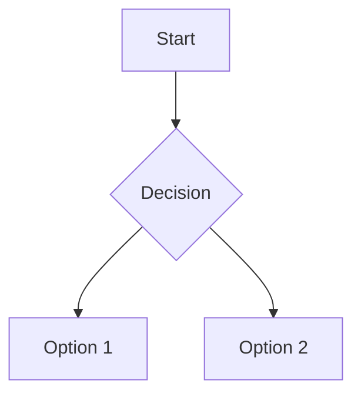

# ColaMD Themes Preview — Visual Theme Showcase

## Overview

This skill complements `colamd-themes` by adding visual preview capabilities:

- **Static HTML preview** — Generate a standalone HTML file showcasing a theme
- **Batch comparison** — Compare multiple themes in one page with synchronized scrolling
- **Dev server** — Hot-reload preview server for theme development
- **Demo content** — Includes comprehensive Markdown examples (headings, lists, tables, code blocks, Mermaid diagrams, math, etc.)

## When to Use

- After generating a theme with `colamd-themes extract` → preview it before validation
- When choosing between multiple extracted themes → batch compare
- During theme fine-tuning → use dev server for instant feedback
- Before sharing a theme → generate polished showcase page

## Prerequisites

- Node.js ≥ 18
- ColaMD-themes project at: `/Volumes/DATA/data/develop/git/ColaMD-themes`
- Theme CSS files available in `themes/` directory

## Commands

### Generate Static Preview for a Single Theme

```bash
colamd-themes-preview generate <theme.css> [options]
# Output: themes-preview/<theme-name>-preview.html
```

Options:

| Flag | Description |
|------|-------------|
| `-c, --content <file.md>` | Custom Markdown content (default: built-in demo) |
| `-o, --output <path>` | Output HTML file path |
| `-t, --title <text>` | Page title |
| `--embedded` | Embed theme CSS directly (single file) |
| `--no-mermaid` | Skip Mermaid demo section |

### Batch Compare Multiple Themes

```bash
colamd-themes-preview compare <theme1.css> <theme2.css> [theme3.css...] [options]
# Output: themes-preview/comparison-<timestamp>.html
```

Features:
- Themes displayed in vertical tabs
- Synchronized scroll position
- Common content rendered under each theme
- Visual diff indicators (color swatches)

### Start Development Preview Server

```bash
colamd-themes-preview serve [options]
# Serves at http://localhost:3000
```

Options:

| Flag | Description |
|------|-------------|
| `-p, --port <number>` | Server port (default: 3000) |
| `-w, --watch <dir>` | Watch directory for CSS changes |
| `-t, --themes-dir <dir>` | Themes directory (default: `themes/`) |
| `--open` | Open browser automatically |

Auto-reload: When a watched CSS file changes, the page refreshes automatically.

### Export Demo Content

```bash
colamd-themes-preview export-demo <output.md>
# Generates comprehensive Markdown with all element types
```

### Audit Theme against Document Type

```bash
colamd-themes-preview audit <theme.css> [options]
```

Performs a comprehensive audit of the generated CSS against type-specific design constraints and prints a compliance score.

Options:

| Flag | Description |
|------|-------------|
| `-t, --type <type>` | Document type: `document` (meeting minutes, reports), `design` (web page conversions), `ppt` (PDF from slides) |
| `-s, --source <file>` | Source file (DOCX/PDF) to compare against (used for PPT type) |
| `-f, --format <fmt>` | Report format: `text` (default), `json`, `html` |
| `--strict` | Exit with non-zero code on ANY violation (default: only MUST/MUST_NOT failures) |

The audit checks:

- Color values against type expectations
- Font stacks for appropriateness
- Mermaid preset suitability
- Print styles synchronization (critical for PPT and document types)
- Contrast ratios and accessibility
- Conformance to v3.0 paradigm rules

Output includes overall score (0–100) and categorized issues (CRITICAL, WARNING, INFO).

Example:

```
Audit: meeting-minutes.css (type: document)
Overall score: 92/100

CRITICAL:
  (none)

WARNINGS:
  - Accent saturation 0.72 exceeds document-type max 0.6
  - Consider a more muted blue for formal documents

INFO:
  - Mermaid preset: light (recommended)
  - Font stack includes CJK fallbacks: Yes
```

## Built-in Demo Content

The preview includes this sample Markdown structure:

```
# Heading 1
## Heading 2
### Heading 3

Paragraph with **bold**, *italic*, `inline code`, [links](https://example.com), and ~~strikethrough~~.

> Blockquote with *emphasized* text and a link.

- Unordered list item 1
- Unordered list item 2
  - Nested item
  - Another nested item

1. Ordered list item 1
2. Ordered list item 2
   1. Nested ordered item

- [ ] Task list item (unchecked)
- [x] Task list item (checked)

```python
def hello():
    print("Hello, ColaMD!")
```

| Header 1 | Header 2 | Header 3 |
|----------|----------|----------|
| Cell 1   | Cell 2   | Cell 3   |
| Cell 4   | Cell 5   | Cell 6   |

---



$$
\int_{a}^{b} x^2 dx
$$

---

[[toc]]
```

## HTML Preview Features

Generated preview pages include:

1. **Theme metadata bar** — name, color system, mermaid preset
2. **Color palette swatches** — seed colors displayed as swatches
3. **Typography samples** — heading and body font renders
4. **Full Markdown rendering** — all ColaMD-supported elements
5. **Print preview toggle** — switch to print stylesheet view
6. **Mobile responsive toggle** — simulate mobile viewport
7. **CSS source viewer** — collapsible panel to inspect the theme file
8. **Download button** — export the theme CSS

## Batch Comparison Layout

Comparison page organizes themes horizontally (if < 4 themes) or in tabs:

- **Color palette matrix** — side-by-side swatch comparison
- **Shared scroll container** — all themes scroll together
- **Highlight differences** — hover a theme to emphasize it
- **Export all** — zip all themes + preview HTML

## Development Server Workflow

```bash
# Start server with watch
colamd-themes-preview serve -w themes/

# In another terminal, edit your theme CSS
# Browser auto-refreshes on save
```

The server serves:
- `/` — theme selector + preview
- `/preview/<theme-name>` — single theme preview
- `/compare` — batch comparison (query: ?themes=a.css,b.css)
- `/demo-content.md` — raw demo content

## Integration with colamd-themes

Typical workflow:

1. Extract theme:
   ```bash
   colamd-themes extract source.docx --name my-theme --auto-match
   ```

2. Preview it:
   ```bash
   colamd-themes-preview generate themes/my-theme.css --embedded
   ```

3. Fine-tune seed colors manually in `themes/my-theme.css` (SECTION 1 only)

4. Re-preview instantly with dev server:
   ```bash
   colamd-themes-preview serve -w themes/
   ```

5. Validate:
   ```bash
   colamd-themes validate themes/my-theme.css
   ```

6. (Optional) Compare with alternatives:
   ```bash
   colamd-themes-preview compare themes/*.css
   ```

7. Audit against document type expectations:
   ```bash
   colamd-themes-preview audit themes/my-theme.css --type document
   ```

## Code Audit Rules

The `audit` command validates a theme against expectations for its document type. Rules are prioritized:

- **MUST** / **MUST_NOT** — critical non-negotiable constraints (fail audit)
- **SHOULD** / **SHOULD_NOT** — recommended best practices (warnings)
- **INFO** — informational notes (no score impact)

### Document Type Rules

**Document** (meeting minutes, reports, proposals):

- Surface: near-white (Luminance ≥ 0.95)
- Ink: dark (Luminance ≤ 0.2 or hex `#000000`–`#222222`)
- Accent: medium saturation (0.3 ≤ S ≤ 0.6), professional hues (blue, teal, burgundy)
- Mermaid preset: `light`
- Font bodies: serif or clean sans-serif, include CJK fallbacks
- Print styles: MUST match screen colors exactly; `@media print` block must re-declare `--seed-accent` and `--seed-accent-dark` to the same hex values as screen
- Expectation: readability, print-friendliness, conservative palette

**Design** (web page style conversions):

- Surface: varies (light or dark)
- Accent: high saturation (S ≥ 0.6), vibrant colors, possible gradients
- Font families: modern sans-serif stack, may include display fonts
- Mermaid preset: auto-detected based on background luminance
- Print styles: SHOULD preserve brand colors; if source has print styles, compare against them
- Expectation: faithful reproduction of source website's visual identity

**PPT** (PDF from presentation slides):

- Must preserve original slide color scheme (extracted from source PDF)
- Text colors must match original slide text colors within tolerance
- Mermaid colors should follow slide accent palette
- Font choices should reflect slide typography
- Print styles: CRITICAL — print MUST match slide design exactly; verify `@media print` exists and re-declares all seed colors correctly (especially accent)
- Expectation: high fidelity to original slide design, including print output

## Implementation Notes

- Preview HTML uses a simple client-side renderer (marked.js or similar)
- No additional build step required — copies template + injects theme CSS
- Embedded mode inlines the entire CSS to avoid CORS issues when sharing
- Dev server uses `chokidar` for file watching and `ws` for live reload WebSocket

## File Structure

```
ColaMD-themes/
├── .claude/skills/
│   ├── colamd-themes.skill.md          (existing)
│   └── colamd-themes-preview.skill.md  (this skill)
├── src/
│   ├── preview/
│   │   ├── preview-server.ts           (dev server)
│   │   ├── generate-html.ts            (static HTML generator)
│   │   ├── demo-content.md             (built-in Markdown sample)
│   │   └── template.html               (HTML skeleton)
│   └── cli.ts                          (+ new subcommands)
├── themes-preview/                     (output directory)
└── package.json                        (adds preview deps)
```

## Future Enhancements

- Screenshot automation (puppeteer) for documentation
- Export to PDF with print styles applied
- Share to ColaMD community gallery
- AI-driven theme critique (color harmony, contrast feedback)
- Theme package (.zip) with preview, demo, and license
