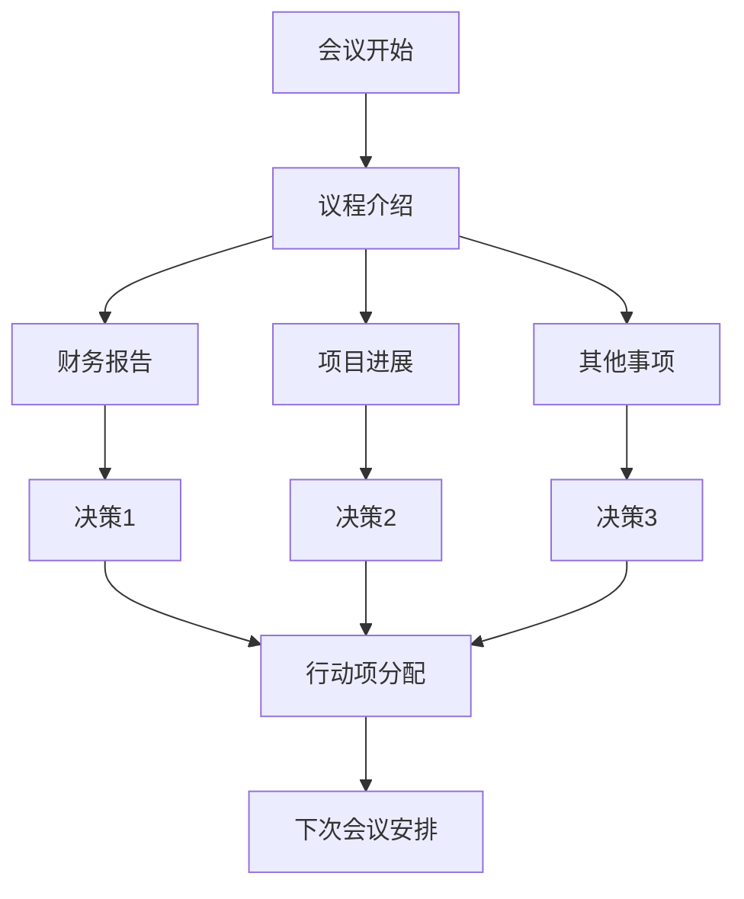
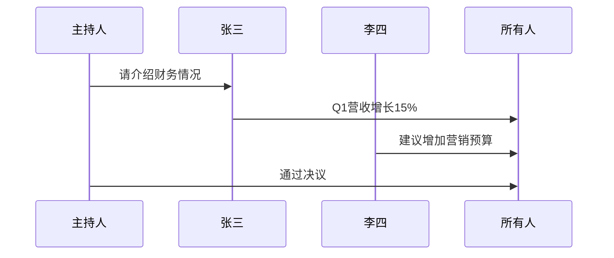

# 会议纪要主题演示

这是 **meeting-minutes** 主题的完整预览。该主题从实际的会议纪要文档中提取，适合正式的商务文档排版。

## 2. 二级标题样式

### 3. 三级标题样式

这是一段普通文本，包含 **粗体**、*斜体*、`行内代码`、[链接](https://example.com) 和 ~~删除线~~。还会包含一些中文文本以测试字体效果。

> 这是一个引用块。引用块通常用于强调或展示外部内容。这里可以包含 *斜体* 和 **粗体** 文本。
>
> —— 会议记录人

### 列表样式

**无序列表：**

- 第一项讨论内容
- 第二项讨论内容
  - 嵌套的子项目 A
  - 嵌套的子项目 B
- 第三项行动项

**有序列表：**

1. 开场致辞
2. 议程第一项：财务报告
   1. 第一季度回顾
   2. 第二季度预测
3. 议程第二项：项目进展
   1. 核心功能完成度
   2. 下一步里程碑

**任务列表：**

- [x] 会议材料准备
- [x] 会议室预订
- [ ] 会后纪要分发
- [ ] 行动项跟进

### 代码块样式

```python
def generate_meeting_minutes(attendees, topics, decisions):
    """
    生成会议纪要
    """
    minutes = {
        "date": datetime.now(),
        "attendees": attendees,
        "topics": topics,
        "decisions": decisions,
        "action_items": []
    }
    return minutes
```

```javascript
// JavaScript 示例
const meeting = {
  title: "Sprint Planning",
  duration: "2 hours",
  participants: ["Alice", "Bob", "Charlie"]
};
```

### 表格样式

| 项目 | 负责人 | 截止日期 | 状态 |
|------|--------|----------|------|
| 用户调研 | 张三 | 2025-06-15 | ✅ 已完成 |
| 原型设计 | 李四 | 2025-06-20 | 🔄 进行中 |
| 开发实现 | 王五 | 2025-07-15 | ⏳ 未开始 |
| 测试验收 | 赵六 | 2025-07-30 | ⏳ 未开始 |

| Header 1 | Header 2 | Header 3 |
|----------|----------|----------|
| Cell 1   | Cell 2   | Cell 3   |
| Cell 4   | Cell 5   | Cell 6   |

---

### Mermaid 图表





---

### 数学公式

$$
\int_{a}^{b} f(x) \, dx = F(b) - F(a)
$$

$$
E = mc^2
$$

---

### 分隔线

---

### 行内元素变体

| 样式 | 示例 |
|------|------|
| 代码 | `const x = 10;` |
| 强调 | *重要内容* |
| 加粗 | **必须完成** |
| 标记 | ==高亮显示== |
| 下标 | H~2~O |
| 上标 | x^2^ |

---

### YAML Frontmatter 示例

```yaml
---
title: 项目周会纪要
date: 2025-05-25
location: 会议室 A305
attendees:
  - 张三 (产品经理)
  - 李四 (技术负责人)
  - 王五 (设计师)
decisions:
  - 同意增加前端开发人员
  - 下周启动用户调研
action_items:
  - { owner: 李四, task: 完成技术方案, due: 2025-06-01 }
  - { owner: 王五, task: 提供设计稿, due: 2025-06-05 }
---
```

---

### 脚注示例

这是一个包含脚注的段落。会议决议需要所有核心成员确认[^1]，并在会后24小时内分发纪要[^2]。

[^1]: 核心成员指产品、技术、设计负责人
[^2]: 分发渠道：企业微信 + 邮件

---

### 定义列表

**Term 1**
: Definition 1a
: Definition 1b

**Term 2**
: Definition 2a

---

<div style="margin-top: 3rem; padding: 1rem; background: var(--seed-panel); border-left: 4px solid var(--seed-accent); border-radius: var(--radius-md);">
  <strong>💡 提示：</strong> 这个主题使用了 <code>macaron-blueberry</code> 配色方案，特点是柔和的蓝色强调色搭配干净的白色背景，适合正式文档和会议纪要。
</div>
